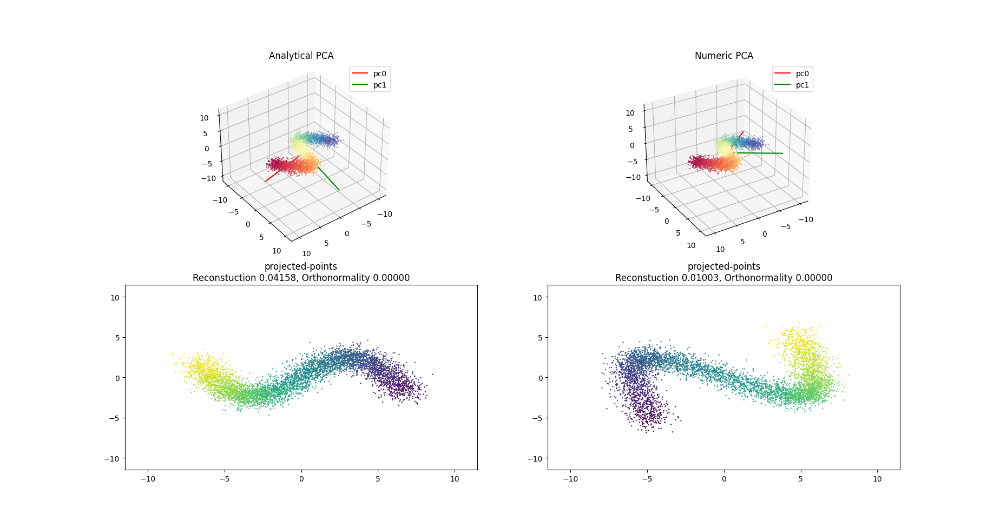

# Understanding PCA
I tried to understand what PCA does so I compared the analytic and the numeric (SGD optimization) 
for the PCA problem.
The PCA problem can be defined in two equivalent ways:
for a set of N point in dimension d (the columns of a matrix X)
1. Minimize ||XAA^T - X|| s.t A^TA = I  where A is a dxd
 In words Minimize reconstruction loss under orthonormality constraing 
 for a projection matrix A
2. Maximize || (AX)(AX)^T || s.t AX = I  where A is a dxd
 In words: Maximize the variance of the projected data AX

I compare the analytic solution to an sgd optimization of the first formulation of the problem.
I used soft constraint instead of a strict one.

