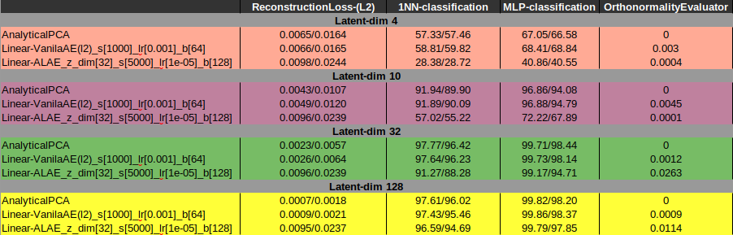

# LabProject-ALAE
Implementation of the paper "Adverserial Latent AutoEncoder" done for my MSc LabProject at HUJI. \
The paper: https://arxiv.org/abs/2004.04467 \
Official implementation https://github.com/podgorskiy/ALAE

# Step one:
Implement ALAE with linear encoder and decoder and compare with PCA which is the optimal linear encoder. 
1. Understanding PCA: PCA could be looked at as projected variance maximization 
    or reconstrcion loss minimization problems under the constraint that the encoding Linear
    matrix is orthonormal.
    the PCA foler shows how gradient decent optimization of the above problems leads to the 
    same solution as the analytic PCA solution for the problem
2. Implement ALAE with linear encoders and generator.
3. Compare various auto-encoders on various datasets in terms of reconstruction loss
4  Compare various auto-encoders by accuracy of clasifiers trained on their encodings 
    of classification datasets (e.g MNIST)
   
The main results of step 1:

##### Relevant materials #####
- PCA: two sided problem: http://alexhwilliams.info/itsneuronalblog/2016/03/27/pca/

# Relevant papers:
- Variational AutoEncoders: https://arxiv.org/abs/1312.6114
- Adverserial AutoEncoders: https://arxiv.org/abs/1511.05644
- AutoEncoders with learned metric: https://arxiv.org/abs/1512.09300
- Adverserial Feature Learning: https://arxiv.org/abs/1605.09782
- StyleGAN: https://arxiv.org/abs/1812.04948
